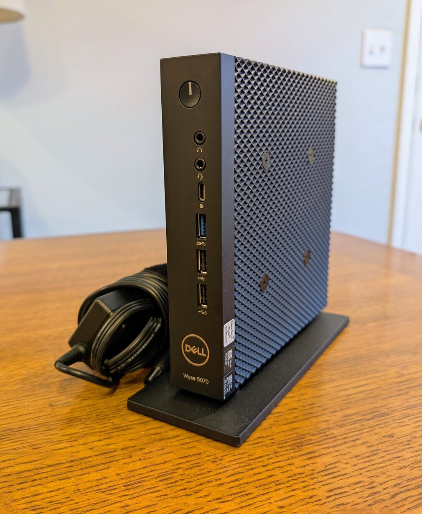
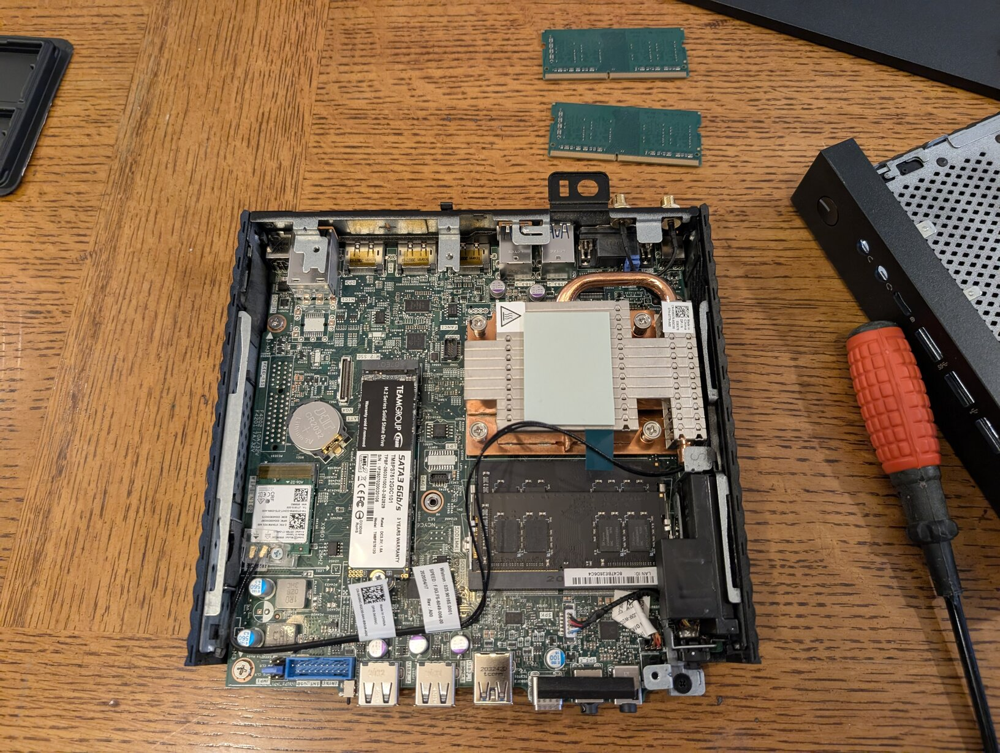
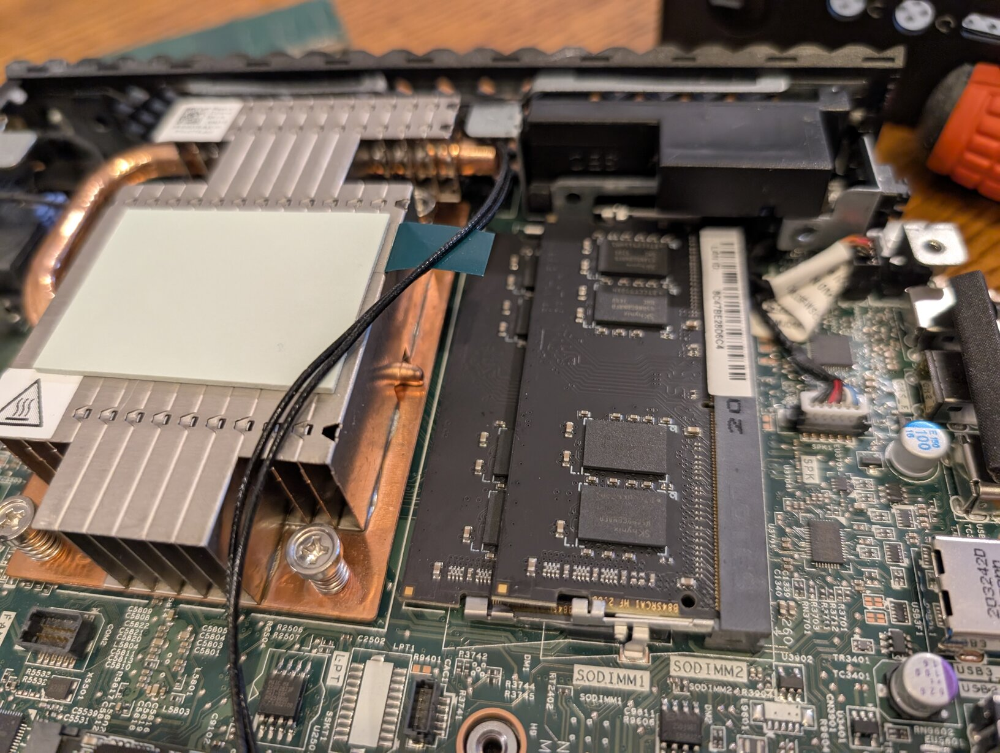
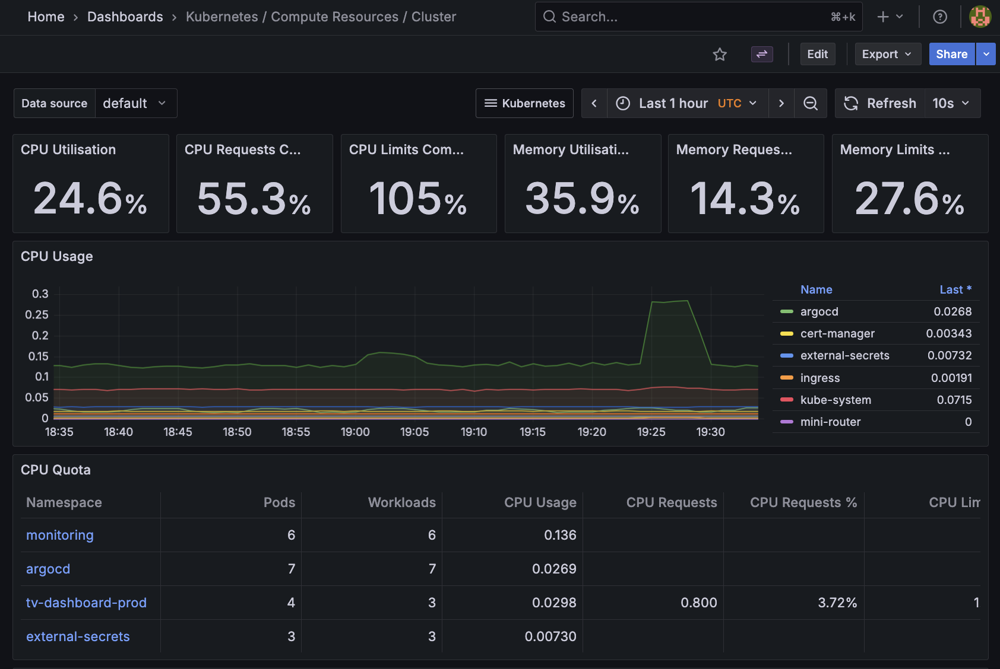

# ✨😶‍🌫️ Kubernetes Homelab: Wyse 5070 + Proxmox + MicroK8s

  
  
  

Self-hosted Kubernetes homelab built on a Dell Wyse 5070 thin client running Proxmox VE with virtualized infrastructure managed by Terraform.

## Hardware
- Dell Wyse 5070 (Intel Pentium Silver J5005, quad-core)
- RAM: 16 GB DDR4 RAM
- Storage: 512 GB M.2 SATA SSD (TeamGroup MS30)
- Networking: 1x GbE (wired)
- Power: 65W Dell adapter, small UPS (battery backup)

## Architecture
- **Hypervisor**: Proxmox VE 9.0 (bare metal)
- **k8s-node1 VM**: Ubuntu 24.04 LTS (200GB disk, 12GB RAM, 3 cores)
  - MicroK8s 1.32+
  - All Kubernetes workloads

## Software
- Terraform (VM and Vault infrastructure as code)
- MicroK8s 1.32+
- HashiCorp Vault (secrets management)
- External Secrets Operator
- ArgoCD (GitOps)
- Cloudflare Tunnel (public access & SSL)
- Tailscale (private network access)
- Prometheus + Grafana (monitoring)

## Applications

### [Mini LLM](https://github.com/navillasa/self-hosted-mini-llm)
LLM chat application with GitHub OAuth authentication and CPU-only inference. Uses llama-cpp-python which had to be custom-compiled on the homelab's legacy hardware in order to run Llama 3.2 1B. Implements asynchronous inference, Prometheus metrics collection, and public monitoring dashboard. GitOps deployment via ArgoCD with GitHub Actions CI/CD featuring security scanning (Trivy), linting workflows, and automated image builds to GHCR.

- **Dev**: https://mini-llm.navillasa.dev
- **Monitoring**: https://mini-llm-monitoring.navillasa.dev

### [TV Dashboard](https://github.com/navillasa/tv-dashboard-k8s)
Full-stack TV show tracking application with PostgreSQL backend. Multi-platform deployment supporting both homelab (MicroK8s) and GKE Autopilot with environment-specific Kustomize overlays. Implements GitOps via ArgoCD with GitHub Actions CI/CD pipeline featuring automated builds, container registry push, and manual promotion workflow between environments.

- **Prod**: https://tv-hub.navillasa.dev
- **Dev**: https://tv-hub-dev.navillasa.dev

### [Multi-cloud LLM Router](https://github.com/navillasa/multi-cloud-llm-router)
AI gateway and intelligent request router for large language models. Built with Go, routes requests across enterprise APIs (OpenAI, Claude, Gemini) and self-hosted LLM deployments (Azure, GCP, AWS). Implements intelligent routing based on configurable criteria: cost optimization, latency prioritization, model availability, and failover handling. Infrastructure provisioned via Pulumi for multi-cloud LLM deployments. Frontend demo deployed on homelab.

- **Demo**: https://demo-multicloud.navillasa.dev

## Services
- **Grafana**: https://grafana.navillasa.dev (monitoring dashboards)

  

## 📚 Documentation

### Setup
- 🧠 [hardware/wyse5070.md](hardware/wyse5070.md) — Hardware specs
- 🖥️ [setup/proxmox-install.md](setup/proxmox-install.md) — Proxmox VE installation
- 💽 [setup/ubuntu-vm-install.md](setup/ubuntu-vm-install.md) — Ubuntu VM creation
- ☸️ [setup/microk8s-install.md](setup/microk8s-install.md) — Kubernetes setup
- 🔑 [setup/network-ssh.md](setup/network-ssh.md) — SSH & firewall
- ☁️ [setup/cloudflare-tunnel.md](setup/cloudflare-tunnel.md) — Cloudflare Tunnel
- 🌐 [setup/tailscale-install.md](setup/tailscale-install.md) — Tailscale

### Infrastructure
- 🏗️ [terraform/](terraform/) — Terraform IaC for Proxmox VMs and Vault config
- 🔐 [k8s/vault/](k8s/vault/) — Vault deployment
- 🔑 [k8s/external-secrets/](k8s/external-secrets/) — External Secrets setup
- 🔒 [k8s/cert-manager/](k8s/cert-manager/) — TLS certificate management
- 📊 [k8s/monitoring/](k8s/monitoring/) — Prometheus + Grafana monitoring stack

### Operations
- 💾 [docs/backups.md](docs/backups.md) — Backup and restore procedures
- 🔌 [scripts/shutdown-homelab.sh](scripts/shutdown-homelab.sh) — Graceful shutdown script

### Guides
- 🚀 [docs/deploying-apps.md](docs/deploying-apps.md) — Deploying applications to homelab

## Status / Changelog
- 2025-12-27: Configure AlertManager to send alerts to my email
- 2025-12-25: Get Mini LLM project successfully hosted
- 2025-10-27: Added backup scripts for Vault, databases, and configs
- 2025-10-27: Fixed Grafana dashboard auto-loading from ConfigMaps
- 2025-10-23: Migrated from bare metal to Proxmox VE virtualization
- 2025-10-23: Added Terraform for infrastructure as code (VMs + Vault)
- 2025-10-23: Installed Tailscale for remote access
- 2025-10-16: Added cluster monitoring with kube-prometheus-stack (Prometheus + Grafana)
- 2025-10-16: Deployed multi-cloud-llm-router demo frontend
- 2025-10-16: Installed Docker for building images locally
- 2025-10-15: Infrastructure refactor - moved Vault/External Secrets to homelab repo
- 2025-10-14: Base install complete, MicroK8s running

## Next
- Self-host GitLab (git hosting + CI/CD + container registry)
- Install second node
