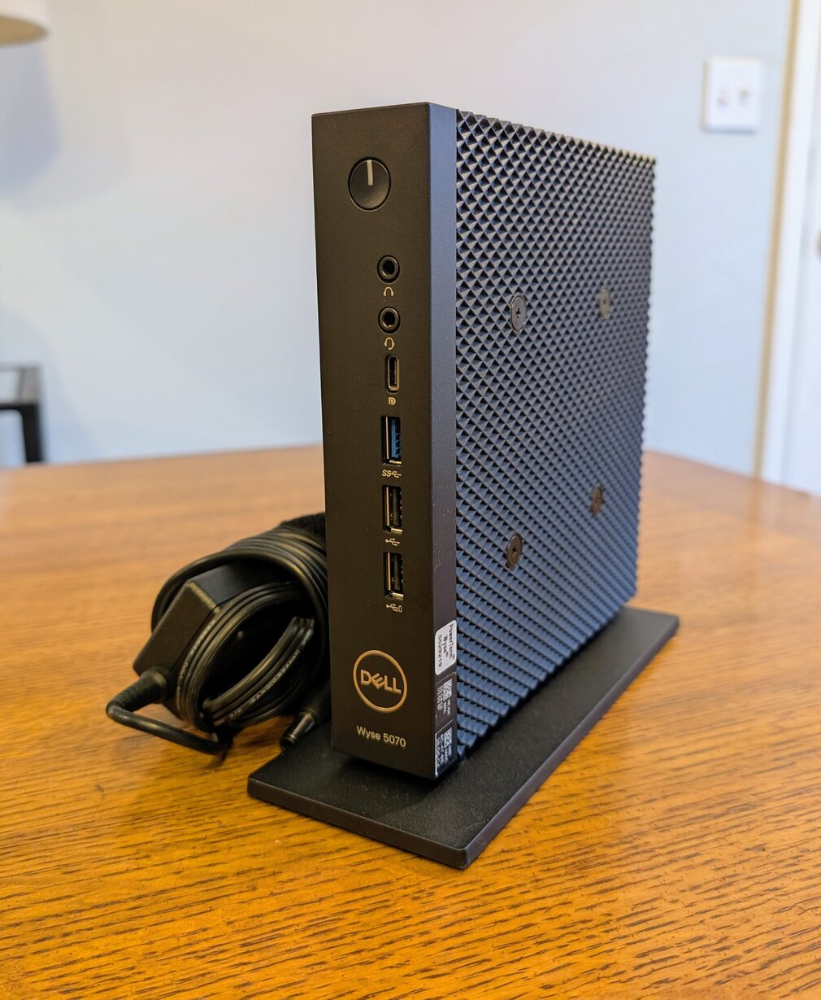
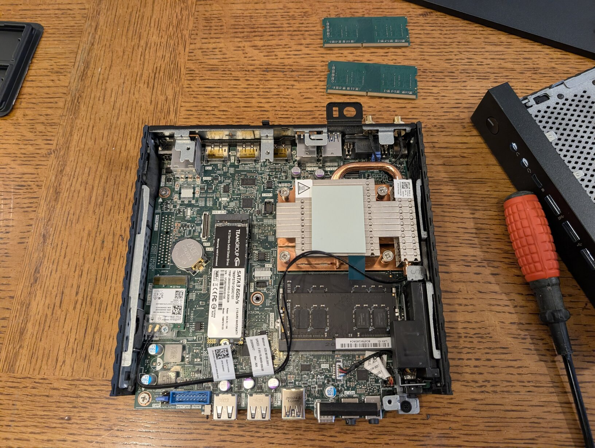
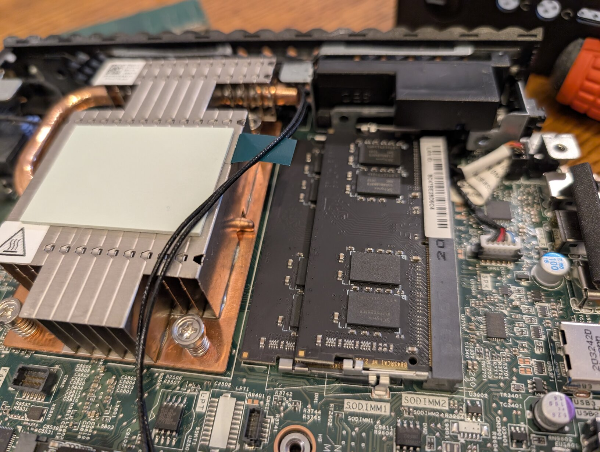

# ✨😶‍🌫️ Kubernetes Homelab — Wyse 5070 + Ubuntu + MicroK8s

  
  
  

Self-hosted single-node Kubernetes lab built on a Dell Wyse 5070 thin client for infra and automation experiments.

## Hardware
- Dell Wyse 5070 (Intel Pentium Silver J5005, quad-core)
- RAM: 16 GB DDR4 RAM
- Storage: 512 GB M.2 SATA SSD (TeamGroup MS30)
- Networking: 1x GbE (wired)
- Power: 65W Dell adapter, small UPS (battery backup)

## Software
- Ubuntu 24.04 LTS (Server)
- MicroK8s 1.32 +
- SSH hardened with UFW

## 📚 Documentation
- 🧠 [hardware/wyse5070.md](hardware/wyse5070.md) — specs, installation steps
- 💽 [setup/ubuntu-install.md](setup/ubuntu-install.md) — clean 24.04 install
-   [setup/microk8s-install.md](setup/microk8s-install.md) — commands & add-ons
- 🔑 [setup/network-ssh.md](setup/network-ssh.md) — SSH setup, firewall

## Status / Changelog
- 2025-10-14: Base install complete, ssh from laptop, microk8s up.

## Next
- Deploy [TV Dashboard K8s](https://github.com/navillasa/tv-dashboard-k8s)
- Setup backups, Tailscale for remote access
